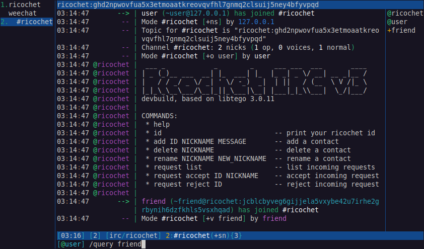

# ricochet-irc
## IRC interface to Ricochet-Refresh (v3.0.11)
`ricochet-irc` is an IRC interface to the
[R2: Ricochet-Refresh](https://github.com/blueprint-freespeech/ricochet-refresh/)
P2P chat network.



For an introduction to Ricochet itself, please refer to
[README-upstream.md](README-upstream.md).

### Building
#### Debian GNU/Linux 12 (bookworm)

```
apt-get update
apt-get install -y git
apt-get install -y cmake tor build-essential libprotobuf-dev protobuf-compiler libssl-dev \
    qtbase5-dev qtdeclarative5-dev qml-module-qtquick-layouts \
    qml-module-qtquick-controls qml-module-qtquick-dialogs qttools5-dev \
    qtmultimedia5-dev qtquickcontrols2-5-dev
```

```
git clone https://github.com/wfr/ricochet-irc/
cd ricochet-irc
git submodule update --init src/extern/tor
git submodule update --init src/extern/fmt

mkdir build
cmake -S ./src -B ./build -G"Unix Makefiles" -DCMAKE_BUILD_TYPE=Debug \
  -DRICOCHET_REFRESH_INSTALL_DESKTOP=OFF -DUSE_SUBMODULE_FMT=ON
cmake --build ./build -j$(nproc)
```

Note that, while the build deps pull in Xorg, the resulting binary does not
link against any graphics libraries. It could be packaged for use on headless
machines.

### Usage
```
./ricochet-irc --help
```
```
Usage: ./ricochet-irc [options]
Anonymous peer-to-peer instant messaging, IRC gateway

Options:
  --config <config-path>  Select configuration directory.
  --port <port>           Set IRC server port.
  --generate-password     Generate random IRC password.
  --debug, --verbose      Verbose output
  -h, --help              Displays help on commandline options.
  --help-all              Displays help including Qt specific options.
  -v, --version           Displays version information.
```

#### IRC interface
Once you are connected to the IRC server, your client is automatically joined
into a control channel `#ricochet`:

```
    @ricochet |  ___ _            _        _     ___ ___  ___       ____
    @ricochet | | _ (_)__ ___  __| |_  ___| |_  |_ _| _ \/ __| __ _|__ /
    @ricochet | |   / / _/ _ \/ _| ' \/ -_)  _|  | ||   / (__  \ V /|_ \
    @ricochet | |_|_\_\__\___/\__|_||_\___|\__| |___|_|_\\___|  \_/|___/ devbuild
    @ricochet |
    @ricochet | COMMANDS:
    @ricochet |  * help
    @ricochet |  * id                            -- print your ricochet id
    @ricochet |  * add ID NICKNAME MESSAGE       -- add a contact
    @ricochet |  * delete NICKNAME               -- delete a contact
    @ricochet |  * rename NICKNAME NEW_NICKNAME  -- rename a contact
    @ricochet |  * request list                  -- list incoming requests
    @ricochet |  * request accept ID NICKNAME    -- accept incoming request
    @ricochet |  * request reject ID             -- reject incoming request
    @ricochet |
    @ricochet | Tor status: offline
           -- | ricochet has changed topic for #ricochet to "ricochet:fdmls67o6sf7ok726y5xfrxurhknoul5vg5augtes43w2eue6eu3nbad"
    @ricochet | Tor status: ready
          --> | afriend (~afriend@ricochet:sczutjtt4vobmm2fpc5w5usz5pogrliggdzwmqhgoslvo7zph764sdqd) has joined #ricochet
```

##### Online/Offline status
`ricochet-irc` connects to the Ricochet network when an IRC client is
attached. You will appear offline to your contacts as soon as you disconnect
from the IRC server.

### Changes
[CHANGES.md](CHANGES.md)

### Miscellaneous notes
#### Convert Hidden Service key to Ricochet format
```
echo $(cut -c 33-95 hs_ed25519_secret_key | base64 -w 0)
```

### License
GPLv3

### Other
Please report bugs in the [issue tracker](https://github.com/wfr/ricochet-irc/issues).


### Donations
If you feel like inviting me (`<wfrisch@riseup.net>`) to a coffee, ...

* [Algorand](https://www.algorand.com): `D3CI5EKC7IRLJMGV74NSKJD6CDXDGS6DT2OQZ4T6NUAB5RIZMTEM37DODI`
* [Monero/XMR](https://www.getmonero.org/): `4245uqJmyoWbWx7w41TL2scKrgk6MtdiYR8ffFiCenJhDx227AbqbU7enMUjwYkHv9W7K6TKZDCLTEnV8ApXih3uNP1B6B3`
