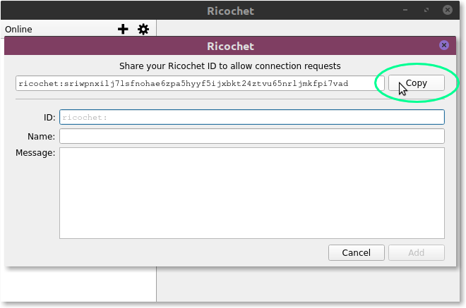
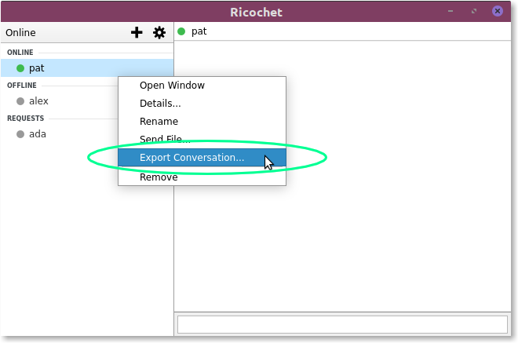

# Ricochet Refresh Installation and Usage Manual

1. [Downloading](#downloading)
1. [Installation](#installation)
1. [Running Ricochet Refresh for the First Time](#running-ricochet-refresh-for-the-first-time)
1. [Usage](#usage)

## Downloading

The latest stable Ricochet Refresh downloads can be found on our website:

- https://www.ricochetrefresh.net/#download

We also have additional packages available on our GitHub Release page:

- https://github.com/blueprint-freespeech/ricochet-refresh/releases

## Installation

### Windows

1. Download the Ricochet Refresh `.exe` installer for your system architecture; either `i686` (32-bit) or `x86_64` (64-bit).
1. When the download is complete, double click the `.exe` file and follow the installation process.

### macOS

#### DMG

1. Download the Ricochet Refresh `.dmg` image (currently only Intel `x86_64` build target is available, but this also automatically runs on newer `arm` M1 Mac computers using Rosetta).
1. When the download is complete, double click the `.dmg` file and mount the image.
1. Drag the Ricochet Refresh application to your Applications folder.
1. Unmount/Eject the `.dmg` disk image.

#### Homebrew

1. From a terminal, run the following install command:
    - `brew install --cask ricochet-refresh`

### Linux

### tar.gz

1. Download the Ricochet-Refresh `.tar.gz` archive for your system architecture; either `i686` (32-bit) or `x86_64` (64-bit). Other CPU architectures are not officially supported or provided.
1. From a terminal, extract the downloaded archive:
    - `tar -xvf ricochet-refresh-$(version)-linux-$(arch).tar.gz`
1. Move the extracted `ricochet-refresh` folder to location appropriate for your system
1. ***(Optional)*** Add `ricochet-refresh` bin to your `$PATH`

### AppImage

1. Download the Ricochet Refresh `.AppImage` binary for your system architecture; either `i386` (32-bit) or `x86_64` (64-bit). Other CPU architectures are not officially supported or provided.
1. From a terminal, add execution permissions to the downloaded bin:
    - `chmod +x ./Ricochet_Refresh-$(arch).AppImage`
1. Move the `.AppImage` file to a locaiton appropriate  for your system
1. ***(Optional)*** Add the `.AppImage` bin to your `$PATH`

### deb

1. Download the Ricochet Refresh `.deb` package for your system architecture; either `i686` (32-bit) or `amd64` (64-bit). Other CPU architectures are not officially supported or provided.
1. From a terminal, install the downloaded package:
    - `sudo apt install ./ricochet-refresh-$(version)-1_$(arch).deb`

## Running Ricochet Refresh for the First Time

The very first time Ricochet Refresh is run, a profile will be created in your system's per-user application data directory. This directory can be found in the following location (depending on your operating system):

- **Windows** : `%USERPROFILE%\AppData\Local\ricochet-refresh\`
- **macOS** : `~/Library/Preferences/ricochet-refresh/`
- **Linux** : `~/.config/ricochet-refresh/`
- **Linux (AppImage)** : `~/.config/Ricochet_Refresh-$(arch).AppImage/`

Your Ricochet-Refresh profile contains your identity, your contacts, and other various settings. The profile is stored in a `json` text file called `ricochet.json` which is saved in your profile directory (described above).

***Important:*** Be sure the backup your `ricochet.json` profile! You will lose your Ricochet Refresh identity and contacts if you lose access to this file.

If you wish to have multiple identities, or use Ricochet Refresh from a portable location (like a USB drive) you can specify the profile directory as the first command-line argument to the ricochet-refresh executable.

## Usage

1. [Configuring Tor](#configuring-tor)
1. [Bypassing Censorsip](#bypassing-censorship)
1. [Sharing your Ricochet ID](#sharing-your-ricochet-id)
1. [Adding a Contact](#adding-a-contact)
1. [Sending a File](#sending-a-file)
1. [Saving a Conversation](#saving-a-conversation)

### Configuring Tor

From the network configuration screen, you can provide the tor daemon any required network configuration:

Most users do not need to update their proxy or firewall settings, but they are provided for users on interesting networks.

### Bypassing Censorship

Ricochet Refresh ensures user privacy and anonymity by using tor. However, many network administrators out there seek to block tor users from accessing the tor network. Users of such networks normally would not be able to use Ricochet Refresh.

### Pluggable Transports

This is where pluggable transports (PTs) come in. You can think of PTs as algorithms or methods used to disguise your tor traffic. They sit in-between the tor daemon and the rest of the tor network.

For example, the Snowflake PT makes your network traffic look like the WebRTC protocol (which is mostly used for video calling) and connects you to a volunteer running a Snowflake endpoint in their browser. However, there are many PTs available and always more in development by the anti-censorship community at large. There is an ongoing arms-race between censors and PT developers, so a PT which works today may not work tomorrow.

The list of currently supported PTs are:

- obfs2
- obfs3
- obfs4
- meek_lite
- scramblesuit
- snowflake

#### Bridges

PTs are the method by which traffic is obfuscated, but they are useless without supporting infrastructure. This is where bridges come in.

You can think of a bridge as a sort of 'endpoint' a PT connects through to get to the tor network (this is not be *technically* true for all PTs but it is still a useful analogy).

Ricochet Refresh lets you circumvent censorship using two different types of bridges: built-in and custom.

##### Built-In

The Tor Project maintains a list of bridge strings that are shipped with Tor Browser. We integrate this list into official Ricochet-Refresh releases as well. The current list of supported built-in bridges are:

- obfs4
- meek-azure (meek_lite)
- snowflake

To use a built-in bridge, select one of them in the Bridges type drop-down on the Configure screen:

Currently (June of 2022), the Snowflake PT is most likely to work on censored network connections.

##### Custom

Some censors also put in the extra effort to periodically get the current built-in bridge list, and block them. To get around this, the Tor Project also maintains multiple methods of acquiring 'secret' unlisted bridges. Said bridges are distributed as 'bridge strings' which may be provided to applications which use tor.

See the Tor Project's official documentation on where and how to acquire these bridge strings:

- https://tb-manual.torproject.org/bridges/

Assuming you have acquired a bridge string, to use it with Ricochet Refresh you must select the 'Custom' Bridge type and paste the bridge string(s) into the provided text box (one per line):

### Adding a Contact

To add a contact to your friends list, click on the '+' (plus, cross) icon on the Ricochet Refresh main screen:

From here you can enter your prospective contact's Ricochet ID, nickname, and a greeting message sent with your initial request. Once you are satisfied, press the 'Add' button and the request will be sent once the user is online.

### Sharing your Ricochet ID

Other Ricochet Refresh users may add you as a contact if they have your Ricochet ID. To find your Ricochet ID, click on the '+' (plus, cross) icon on the Ricochet Refresh main screen as you would when adding a contact.

You can copy your Ricochet ID to the clipboard on the next screen:

Once you have copied your Ricochet ID, you will need to share it with prospective contacts through some other secured channel (encrypted email, for example).

### Sending a File

Ricochet Refresh allows you to privately share files with your contacts. To send a file, right-click (⌘-click on macOS) the (online) recipient's nickname in the contact list and select `Send File...`. If the recipient is offline, the file transfer requst will be sent once both you and the recipient are online (unless you have restarted Ricochet Refresh in the interim).

This will open a system open file dialog where you can select the file to send.

The recipient will receive a message with a special user interface allowing them to manage the file transfer. The 'Download' button (downward pointing arrow icon) will open a system save file dialog where the recipient may specify the download location.

The 'Cancel' button (X or close icon) will reject a pending file transfer request, or cancel one which has already started. The sender may also cancel an in-progress file transfer by pressing their own 'Cancel' button.

### Saving a Conversation

Ricochet Refresh does not save chat history to disk, but sometimes you may wish to keep a record of your conversation. To export the current conversation to disk, right-click your contact's nickname in the contact list and select `Export Conversation...`.

This will open a system save file dialog where you can specify the location to save the conversation as a text file.
